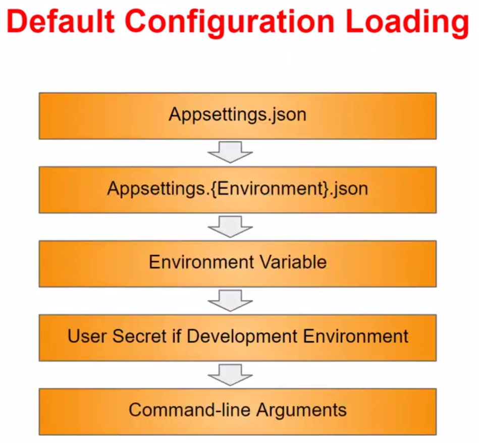
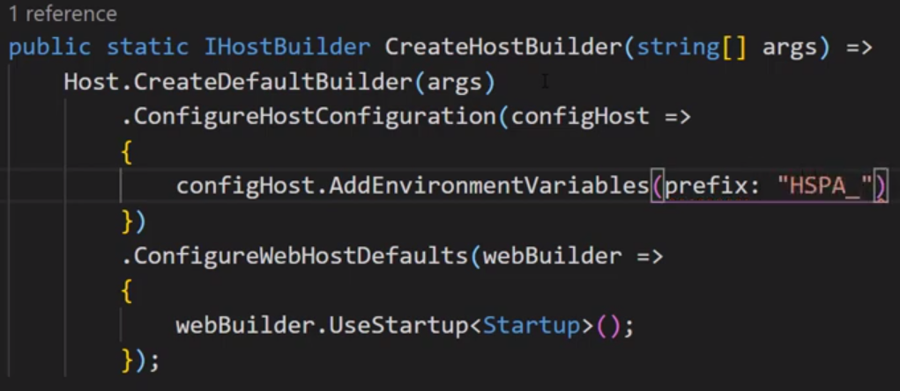
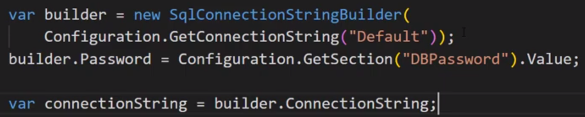

## .NET env handling

* The general pipeline in which env variables are read:


* Automatically looks for env variables with a *standard prefix* of `ASPNETCORE_`, so our DB connection string would be accessible via e.g.
```sh
ASPNETCORE_ConnectionStrings:DocVzDb
```

* Under `Unix` however, the `:` separator character wont work, so we can replace it by a *double underscore*:
```sh
ASPNETCORE_ConnectionStrings__DocVzDb
```

* We can override the *default prefix* with this:


* In order to build a connection string from *ENVs from 2 different sources*:
  * here, the `Default` string in `appsettings.json` simply omits the PW, since it is loaded from an OS ENV variable


